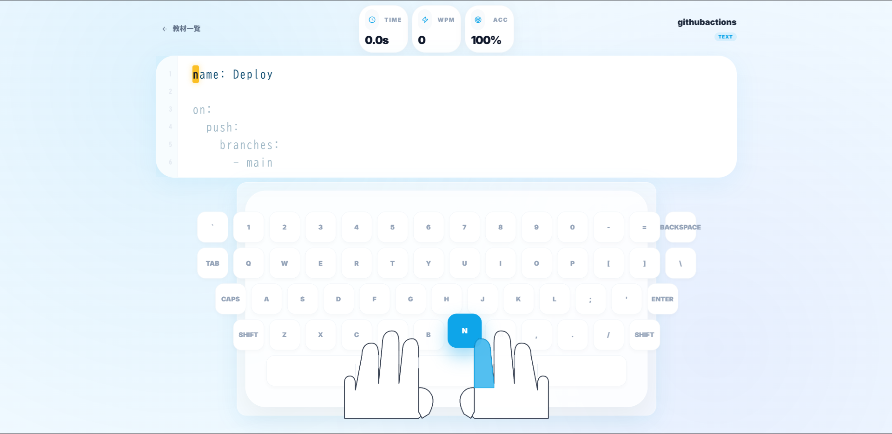

# app:typingpropy
URL https://typingpropy.vercel.app/

使用言語：python,Next.js

##　アーキテクチャー
①vercel ②lambdaurl　③lambda ④　dynamoDB
（更新時）①githubactions ②CDK
## 核技術選定理由
### 大まかに永続無料を目標に選定

- vercel→S3+cloudfrontは１２か月無料でも永続無料×
- apigateway,rds→超過するとコスト高
- cdk→SAMはTS,pythonで書けない/書かない場合毎回変更したらコンソール上で修正しなければいけない

## 作った感想
今まで従量課金制のためどのぐらいの金額が課金されるか不明であったため、大学のころから開発に着手してはいたが手を出せずにいたので本格なフルスタックアプリをデプロイできたため業務に生かしたいと考えている

## 苦労したこと
python,Next.jsの知識はあったもののdockerを使いデプロイする場合AWSのEKSを用いたり、業務レベルだとVPCやEC2などのインフラリソースを用いることが大半の中で
- ローカルから本番環境へのソースの切り出し
- 料金への調整、ホスティングサービス
- githubactionsでのCICDサイクルに必要な環境変数等情報の受け渡し

